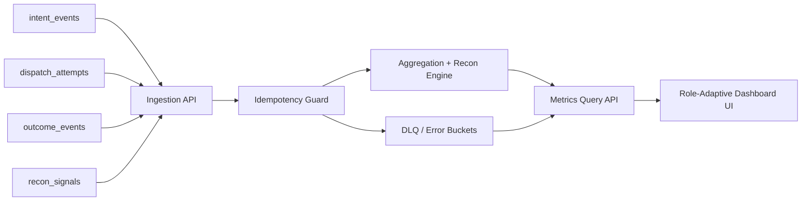

# Zord Dashboard & KPI Architecture V1 (Console-Integrated)

## 1) System Architecture & Service Boundaries

This implementation keeps all code changes inside `zord-console`, while preserving production architecture boundaries through explicit layers:

- Ingestion layer: `/api/prod/zord/events/ingest`
  - Accepts lifecycle events (`intent_events`, `dispatch_attempts`, `outcome_events`, `recon_signals`)
  - Enforces idempotency key: `intent_id:event_type:event_version`
  - Sends malformed events to in-memory DLQ model

- Processing layer: `services/analytics/store.ts` + `services/analytics/query.ts`
  - Reconciliation confidence engine: `PROVISIONAL`, `CONFIRMED`, `VARIANT`
  - Error taxonomy grouping + retry-success intelligence
  - Real-time KPI aggregation windows (`24h`, `7d`, `60m`)

- Query/API layer: `/api/prod/zord/metrics/*`, `/api/prod/zord/intent/:id/detail`, `/api/prod/zord/search`
  - Tenant-scoped reads via `tenant_id` query/header
  - PII-masked responses for sensitive IDs
  - Hot-read TTL cache through `services/analytics/cache.ts`

## 2) Event-Driven Topology (Logical)

## 3) Data Model (Console Analytics Domain)

Core entities represented in TypeScript models (`services/analytics/types.ts`):

- Canonical entities:
  - `IntentRecord`
  - `DispatchAttempt`
  - `OutcomeEvent`
  - `EvidencePack`
  - `DlqItem`

- Recon intelligence:
  - `ReconSignal`
  - `ReconResult` (state + confidence score)

- Error intelligence:
  - `FailureInstance` (category, code, PSP, rail, bank)

- Alerting:
  - `AlertItem`

Aggregation outputs are shaped for widgets and charts (time series, histograms, heatmaps, treemap, matrix).

## 4) API Surface (V1)

Implemented under `app/api/prod/zord`:

- `GET /metrics/overview`
- `GET /metrics/payout-intelligence`
- `GET /metrics/reconciliation`
- `GET /metrics/psp-health`
- `GET /metrics/errors`
- `GET /intent/:id/detail`
- `GET /search`
- `GET /alerts`
- `GET /exports/recent`
- `POST /events/ingest`

All endpoints support tenant scope and return dashboard-ready payloads.

## 5) Frontend Modules (V1)

Implemented pages under `app/customer/zord`:

- Command Center
- Payout / Disbursement Intelligence (NBFC label switch)
- Reconciliation Intelligence
- PSP Health Monitor
- Error Taxonomy Intelligence
- Intent Journal & LLM Explainability

Navigation and personalization are metadata-driven (`_config/modules.ts`), not separate products.

## 6) Performance & Scalability Notes

- Search endpoint returns `meta.response_ms` to track `<200ms` objective
- Query caching via TTL map for hot widgets
- Polling cadences tuned by module:
  - Command Center / PSP health: 30s
  - Recon / Errors: 45–60s
- Data model and endpoint contracts are isolated so service extraction to dedicated analytics microservice is straightforward

## 7) Compliance & Privacy Controls

- Sensitive values are masked before response rendering (`maskSensitive`)
- Tenant isolation enforced by `tenant_id` scoping in every analytics query
- Evidence/export operations are observable through explicit queue endpoint (`/exports/recent`)

## 8) Known V1 Console Constraint

This build intentionally keeps processing in the console codebase per implementation directive. The architecture maps directly to a deployable split-service model, so migration to dedicated analytics microservices remains low-friction.
