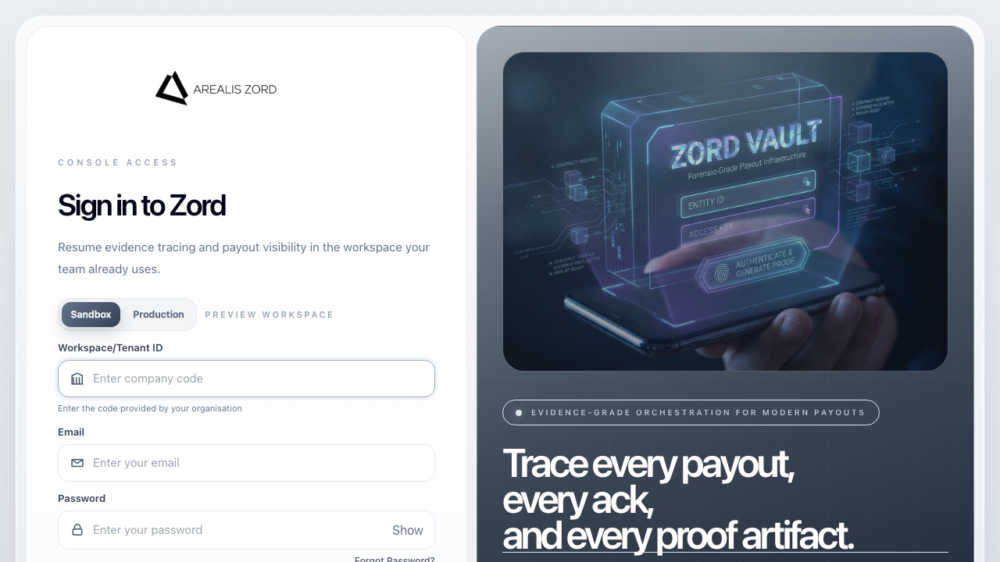
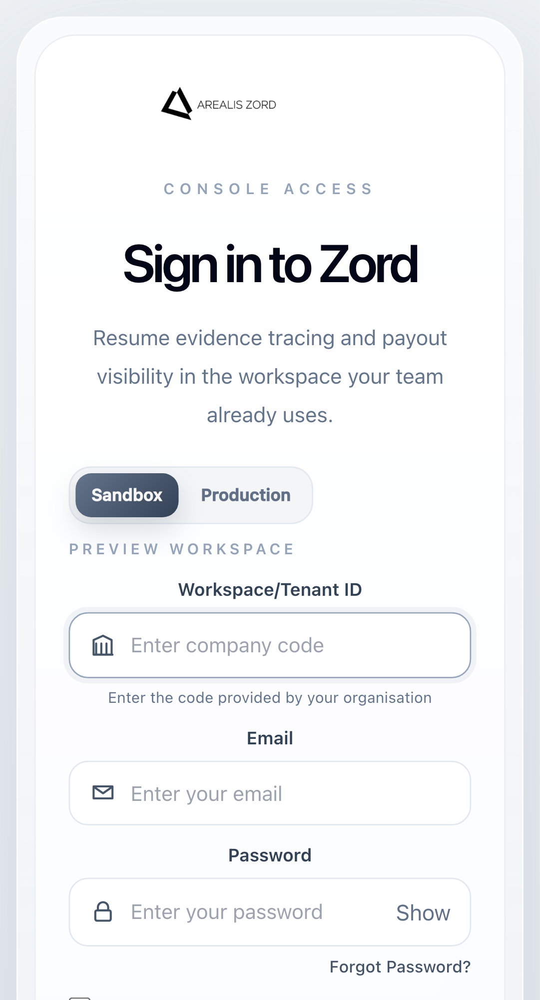

# Zord Frontend Login Report

## Document Control

| Field | Value |
| --- | --- |
| Document status | Draft for lead review |
| Audience | Engineering leads, design reviewers, frontend leads, QA reviewers |
| Scope owner | Zord console login and auth integration |
| Last updated | 2026-04-07 |
| Related documents | `ZORD_IMPLEMENTATION_SUMMARY.md`, `ZORD_AUTH_BACKEND_REPORT.md`, `ZORD_LOCAL_RUNBOOK.md` |

## Version History

| Version | Date | Summary |
| --- | --- | --- |
| `v1.0` | 2026-04-07 | Initial frontend login/auth report |
| `v1.1` | 2026-04-07 | Added screenshots, review structure, and local run appendix link |
| `v1.2` | 2026-04-07 | Added Dockerized console validation notes and runtime blockers found during live testing |
| `v1.3` | 2026-04-07 | Added admin console page for creating and managing login users |

## Scope
This report covers the console login and auth integration changes inside `backend/zord-console`.

## Goal
The login experience needed two things at the same time:

- a cleaner and more polished UI
- a real backend-backed auth flow instead of mock local storage state

## What Changed

### Auth integration
The console now talks to same-origin Next.js auth proxy routes instead of storing auth tokens in browser storage.

New proxy routes:

- `backend/zord-console/app/api/auth/login/route.ts`
- `backend/zord-console/app/api/auth/refresh/route.ts`
- `backend/zord-console/app/api/auth/logout/route.ts`
- `backend/zord-console/app/api/auth/me/route.ts`

Supporting auth server helper:

- `backend/zord-console/services/auth/server.ts`

Additional admin auth proxy routes:

- `backend/zord-console/app/api/auth/admin/users/route.ts`
- `backend/zord-console/app/api/auth/admin/users/[id]/status/route.ts`

Client/session integration updates:

- `backend/zord-console/services/auth/authService.ts`
- `backend/zord-console/app/hooks/useAuth.ts`
- `backend/zord-console/middleware.ts`
- `backend/zord-console/app/layout.tsx`
- `backend/zord-console/components/auth/AuthSessionBootstrap.tsx`

### Login UI updates
The login experience was redesigned and cleaned up through:

- `backend/zord-console/components/auth/ZordLoginExperience.tsx`
- `backend/zord-console/components/auth/LoginFormDark.tsx`
- `backend/zord-console/components/auth/MFAForm.tsx`
- `backend/zord-console/components/ZordLogo.tsx`

Route-level login pages updated:

- `backend/zord-console/app/console/login/page.tsx`
- `backend/zord-console/app/customer/login/page.tsx`
- `backend/zord-console/app/ops/login/page.tsx`
- `backend/zord-console/app/admin/login/page.tsx`

Admin access-management page:

- `backend/zord-console/app/admin/tenants/page.tsx`

## UX Changes Implemented

| Area | Change |
| --- | --- |
| Workspace field | Changed to `Workspace/Tenant ID` |
| Identity field | Email-only login |
| Password field | Required with proper empty-state validation |
| Submit behavior | Button disabled until form is valid |
| Error states | Backend-driven error messaging |
| Session storage | Auth tokens moved to `HttpOnly` cookies |
| Role handling | Route protection based on server-backed session hint |
| App Final protection | `/app-final` now uses the same protected customer-role auth gate as `/console` |
| Admin provisioning UI | `/admin/tenants` creates and manages login users against the real auth backend |

## Login Form Structure

| Order | Field |
| --- | --- |
| 1 | `Workspace/Tenant ID` |
| 2 | `Email` |
| 3 | `Password` |

## Validation Added

| Validation Type | Rule |
| --- | --- |
| Field-level | Workspace is required |
| Field-level | Email must be valid format |
| Field-level | Password must be non-empty |
| Form-level | Login button stays disabled until valid |

## Error States Connected

| Backend Case | UI Message |
| --- | --- |
| Wrong credentials | `Invalid email or password` |
| Wrong workspace | `Workspace not found` |
| User in another workspace | `Account not part of this workspace` |
| Locked account | `Account temporarily locked` |

## Design Changes

| Area | Result |
| --- | --- |
| Layout | Split clean auth panel and visual panel |
| Branding | Updated Arealis Zord logo usage |
| Header spacing | Reduced spacing above `Console Access` |
| Form density | Reduced large gaps between labels, inputs, and button |
| Right-side showcase | Simplified visual card and removed vague partner clutter |
| Auth copy | Cleaner headline and supporting text |

## Problems Faced

| Problem | Impact |
| --- | --- |
| Mock auth state in local storage | Browser could appear logged in without backend truth |
| Hydration mismatch in homepage/showcase CSS | React dev overlay errors and unstable rendering |
| Repeated `/_next/static` chunk and CSS 404s | Login page would load with broken JS/CSS assets |
| Two concurrent Next dev servers | One app instance would serve HTML while another owned the chunk manifest |
| Login form spacing and card density | UI looked too loose and hard to scan |
| Root stack console bring-up competed with local host ports | Dockerized login validation needed a controlled alternate port |
| Tenant registration had no follow-up UI for adding email logins | Admins still needed direct API calls to create auth users |

## How Those Problems Were Fixed

| Problem | Fix |
| --- | --- |
| Mock auth | Added same-origin auth proxy routes and cookie-backed session flow |
| Token exposure risk | Kept access and refresh tokens in `HttpOnly` cookies |
| Hydration mismatch | Stabilized style rendering and root hydration handling |
| Chunk/CSS 404s | Added a single-process dev wrapper that kills stale console servers and clears `.next` |
| Duplicate dev ports | `npm run dev` now starts one clean server on `3000` |
| Loose layout | Tightened form spacing and simplified right-side content |
| Root stack port conflict during runtime validation | Ran a production-built console container on `3001` to validate the auth proxy path against Dockerized `zord-edge` |
| No UI for adding email access | Added `/admin/tenants` with workspace list, login-user creation form, and status toggle actions |

## Dev Reliability Fix
To stop recurring stale chunk errors, the console startup was hardened through:

- `backend/zord-console/scripts/dev-single-process.mjs`
- `backend/zord-console/package.json`

Behavior now:

| Startup step | Behavior |
| --- | --- |
| Port cleanup | Stops stale `zord-console` Next servers on `3000` and `3001` |
| Cache cleanup | Removes stale `.next` and node cache |
| Boot target | Starts one fresh Next dev server on `3000` |

## Screenshots

### Desktop Login

Source:
- `docs/reports/assets/zord-console-login-desktop.png`

### Mobile Login

Source:
- `docs/reports/assets/zord-console-login-mobile.png`

## Tests and Verification

| Command | Result |
| --- | --- |
| `npm run build` in `backend/zord-console` | Passed |
| `node --check backend/zord-console/scripts/dev-single-process.mjs` | Passed |
| Clean `npm run dev` restart | Passed, server restarted on `http://localhost:3000` |
| `curl -I http://localhost:3001/console/login` | Passed, Dockerized console returned `200 OK` |
| `curl -i http://localhost:3001/api/health` | Passed |
| `POST http://localhost:3001/api/auth/login` with invalid workspace | Passed, console proxy returned backend-driven auth error instead of transport failure |

## Docker Runtime Notes

| Area | Observation |
| --- | --- |
| Console image | Builds successfully from root compose |
| Dockerized console login | Confirmed reachable on temporary port `3001` |
| Same-origin auth proxy | Confirmed to reach Dockerized backend auth and return structured failures |
| Full root-stack console run | Still depends on clearing unrelated local port conflicts before using `3000` directly |

## Approval Checklist

| Check | Status |
| --- | --- |
| Login uses same-origin auth proxy routes | Complete |
| Tokens are removed from browser-visible storage | Complete |
| Login form matches new field order | Complete |
| Submit button waits for valid form state | Complete |
| Backend-driven auth errors are surfaced | Complete |
| Protected routes use session/role markers | Complete |
| `/app-final` is covered by auth middleware | Complete |
| Admin can create login users from console UI | Complete |
| Repeated dev chunk/CSS 404s addressed | Complete |
| Playwright login regression tests | Deferred |

## Appendix A: Local Frontend Run Reference
For exact startup commands and environment handoff between console and `zord-edge`, see:

- `docs/reports/ZORD_LOCAL_RUNBOOK.md`

## Notes for Future Work

| Area | Suggested next step |
| --- | --- |
| UI polish | Add a final visual pass once brand assets are finalized |
| Session UX | Add idle timeout and toast messaging for expired sessions |
| Admin tools | Add invite/reset flows and richer filtering on top of the new user-management screen |
| Test coverage | Add Playwright login/session regression coverage |

## Outcome
The frontend login flow is now both cleaner and more reliable. The user sees a polished login page, while the actual session is managed safely through backend auth and `HttpOnly` cookies instead of browser-local mock state.
